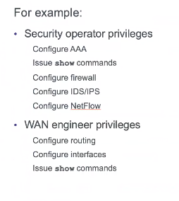

# 2020/06/10 - 第1回

## 内容

### ルータのセキュリティテクノロジーパッケージライセンスの有効化

```
> enable
# configure terminal
(config)# license boot module c1900 technology-package securityk9
〜略
ACCEPT? [yes/no]: yes
(config)#end
#copy running-config startup-config
Destination filename [startup-config]? 
# reload
〜略
# show version
〜略
----------------------------------------------------------------
Technology    Technology-package          Technology-package
              Current       Type          Next reboot
-----------------------------------------------------------------
ipbase        ipbasek9      Permanent     ipbasek9
security      securityk9    Evaluation    securityk9
~~~~~~~~~~~~~~~~~~~~~~~~~~~~~~~~~~~~~~~~~~~~~~~~~~~~~`　　　　　　　　　　　　　　　　　
data          disable       None          None

Configuration register is 0x2102
```

### ルータパスワードの最小パスワード長を設定

`security passwords`コマンドを使用し、最低10文字のパスワードの設定をする
```
R1(config)#security passwords min-length 10
```

### 特権暗号化パスワードの設定

両方のルータで特権暗号化パスワードを設定する。タイプ9(SCRYPT)ハッシュアルゴリズムを使用する。

```
enable secret class
enable algorithm-type scrypt secret cisco12345
下の文はPacket Tracerでは設定できない
```

イネーブルシークレットパスワードを設定すると、ルータが攻撃によって侵害されるのを防ぐのにどのように役立ちますか。

### 演習

#### コンソール、aux, vtyのパスワードをそれぞれ以下に設定する

- コンソール: ciscoconpass
- aux: ciscoauxpass 
- vty: ciscovtypass
- 同期ロギングも設定

```
line vty 0 15
password ciscovtypass
login
transport input telnet
exit
line con 0
password ciscoconpass
login
exit
line aux 0
password ciscoauxpass
login
exit
```

パスワード確認

```
show run
```

#### 保存されているパスワードを暗号化するコマンド

```
Router(config)# service password-encryption
```

##### 暗号化パスワードの前に表示される数字`5`や`7`は何を表すものか

- 4: SHA-256
- 5: MD5
- 6: [AES](https://www.cisco.com/c/en/us/td/docs/switches/datacenter/sw/6_x/nx-os/security/configuration/guide/b_Cisco_Nexus_7000_NX-OS_Security_Configuration_Guide__Release_6-x/b_Cisco_Nexus_7000_NX-OS_Security_Configuration_Guide__Release_6-x_chapter_010101.html)
- 7: 脆弱
- 8: PBKDF2
- 9: SCRYPT

```
HackMD 抜粋(松山)
通常のデバイスではsecretコマンドでは5,passwordコマンドで0が自動的に適用される
なおpassword 7コマンドは無効コマンドになってるっぽい。
service pass-encryptionでpass 0で設定したものを暗号化することでpass 7が適用される。
バージョンや機器によっては4かも 
```

#### バナーメッセージを表示

MOTDバナーメッセージ `Unauthorized access strictly prohibited!` を表示するコマンドを実行。

```
(config)#banner motd $Unauthorized access strictly prohibited!$
```

#### ログインユーザの設定

```
username <ユーザ名> password <パスワード>
```

アルゴリズムを選ぶ場合(Packet Tracer不可)

```
username <ユーザ名> algorithm-type ?
```

上記コマンドのアルゴリズム指定

- [Ciscoコミュニティ](https://learningnetwork.cisco.com/s/article/cisco-routers-password-types)

#### ルーターにローカルユーザを登録、ログイン時に使用するように設定を追加

```
Router(config)# username user01 password user01pass
Router(config)# line console 0
Router(config-line)# login local
Router(config-line)# end
Router# exit
```

VTY回線でも設定可能。

ログインしているユーザの確認

```
R1#show users
    Line       User       Host(s)              Idle       Location
*  0 con 0     sakabe     idle                 00:00:00 
 134 vty 0     sakabe     idle                 00:00:05 10.2.2.1

  Interface    User               Mode         Idle     Peer Address
```

vty: telnet 脆弱性マシマシ -> ssh

#### ルータにSSHでアクセスする設定

1. ドメイン名の設定
2. クライアントからアクセスするユーザの特権レベルの指定
3. SSHでの着信を許可する
4. 暗号化の鍵を生成
5. SSHのバージョン設定
6. タイムアウト設定
7. 認証リトライ回数設定

```
Router(config)# ip domain-name ccnasecurity.com

Router(config)# username admin privilege 15 secret cisco12345
```

余談: Packet Tracerには入らないが、以下がアルゴリズムまで指定したコマンド。
```
R1(config)# username admin privilege 15 algorithm-type scrypt secret cisco12345
```

続き

```
Router(config)# line vty 0 4
Router(config-line)# privilege level 15
Router(config-line)# login local
Router(config-line)# transport input ssh
Router(config-line)# exit

Router(config)# crypto key generate rsa general-keys modulus 1024

Router(config)# ip ssh version 2

Router(config)# ip ssh time-out 90
Router(config)# ip ssh authentication-retries 2

Router(config)# end
Router# copy running-config startup-config
```

`modulus`: 係数

PCからSSH接続

```
ssh -l <ユーザ名> <アドレス>
```

#### クライアントからルータへ設定ファイルを転送する方法

1. SSH接続し、設定ファイルの内容をコピー&ペースト
    > 即座にrunning-configに反映される
2. リモートホストにファイルを安全にコピーする -> SCP
    > Windowsでの有効化
    > - Git Bashをインストールする
    > - Tera Termを使用する

#### ルータをSCPサーバにする

1. AAAを有効化する
2. ローカルで認証と認可の設定をする
3. SCPを有効化する

##### 設定

```
Router(config)# aaa new-model
Router(config)# aaa authentication login default local
Router(config)# aaa authorization exec default local
Router(config)# ip scp server enable
Router(config)# end
Router# copy running-config flash:
Destination filename [running-config]? R1-config
R1#show flash:

System flash directory:
File  Length   Name/status
  4   1747     R1-config
  3   33591768 c1900-universalk9-mz.SPA.151-4.M4.bin
  2   28282    sigdef-category.xml
  1   227537   sigdef-default.xml
[33849334 bytes used, 221894666 available, 255744000 total]
249856K bytes of processor board System flash (Read/Write)
```

##### copyコマンドの指定

```
copy running-config <指定>

flash:         Copy to flash file
ftp:           Copy to current system configuration
scp:           Copy to scp: file system
startup-config Copy to startup configuration
tftp:          Copy to current system configuration
```

`scp:`を指定すると、`Address or name of remote host []?`と聞かれるので、コピーしたいアドレスを指定する
```
Router3での操作(失敗してるけど)

Router# copy scp: flash:
Address or name of remote host []? 192.168.1.1
Source username [R3]? user01
Source filename []? R1-config
Destination filename [R1-config]?

Password:

Unauthorized access strictly prohibited!

%Error opening scp://*****@192.168.1.1/R1-config (No such file or directory)
```

### Topic 2.2.2:
- Configuring Role-Based CLI
> ユーザ(役割)によってコマンドの使用権限(View)を設定する。以下は例。
> 
> 
> 
> Packet Tracerで次回設定。
