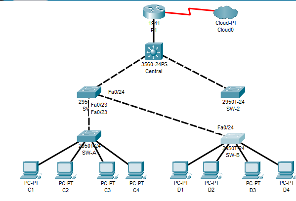

# 2020/07/15 - 第6回

## 課題1

### コマンド

#### Central

```
spanning-tree vlan 1 root primary
interface range f0/23 - 24
spanning-tree guard root
```

#### SW-1

```
spanning-tree vlan 1 root secondary
interface range f0/23 - 24
spanning-tree guard root
```

#### SW-2

```
```

#### SW-A

```
interface range f0/1 - 4
spanning-tree portfast
spanning-tree bpduguard enable
int range f0/1 - 22
switchport mode access
switchport port-security
switchport port-security
switchport port-security maximum 2
switchport port-security violation shutdown
switchport port-security mac-address sticky
int range f0/5 - 22
shutdown
```

#### SW-B

```
interface range f0/1 - 4
spanning-tree portfast
spanning-tree bpduguard enable
int range f0/1 - 22
switchport mode access
switchport port-security
switchport port-security
switchport port-security maximum 2
switchport port-security violation shutdown
switchport port-security mac-address sticky
int range f0/5 - 22
shutdown
```

### 設問パート1

#### ステップ1

- どのスイッチがルートブリッジか
> SW-1
> - トポロジ

#### ステップ4

- 現在のルートブリッジ
> Central
> - ツールがないのでトポロジに書き込めないので説明
> > - SW-2, SW-1間のポートは切断されている(SW-2側)
> > - SW-A, SW-2間のポートが切断されている(SW-A側)
> > - SW-2, SW-B間のポートは切断されている(SW-B側)

### 設問パート3

#### ステップ1

- 他のスイッチデバイスに接続されているポートでポートセキュリティが有効にならないのはなぜ
> 学習するMacアドレスの最大数が2のため

### 設問パート4

- 設問の回答(上記)
- コマンド(上記)
- パート3, ステップ2で学習したMACアドレスの明記とC1と一致するかどうか
> 0060.3E81.4647:1、一致する

## 課題2

### コマンド

#### スイッチ全部共通の

```
(config)# vlan 20
(config)# interface vlan 20
(config-if)# ip address 192.168.20.? 255.255.255.0

<100~104, 管理用PCに105を振る。R1だけごっちゃにならないように254>
```

#### SW-1, SW-2

```
(config)# interface f0/23
(config-if)# switch mode trunk
(config-if)# switch tru native vlan 15
(config-if)# switch none
```

#### SW-A

```
(config)# interface f0/1
(config-if)# swi mode ac
(config-if)# swi ac vlan 20
```

#### R1

```
(config)# interface g0/0.3
(config-if)# enc d 20
(config-if)# ip address 192.168.20.254 255.255.255.0
```

ここまでで90%くらい。ちゃんとPCとか配線してれば100%

#### R1(ACLの設定)

```
(config)# ip access-list ex 100 
(config-router)# permit ip host 192.168.20.105 any
<自分の環境次第で105は変える>
(config-router)# deny ip any any
(config-router)# exit
(config)# int g0/0.3
(config-if)# ip access-group 100 in
```

### 設問

- 管理PCから、SW-A, SW-B, R1へのPingは通るか
> 接続できる
- D1から管理PCにPingできるか
> 失敗する