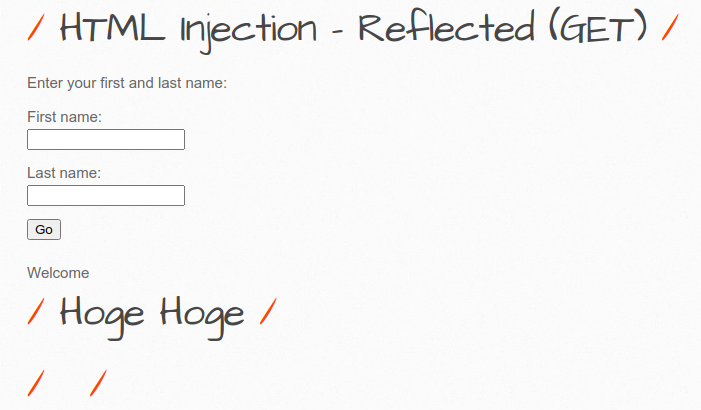
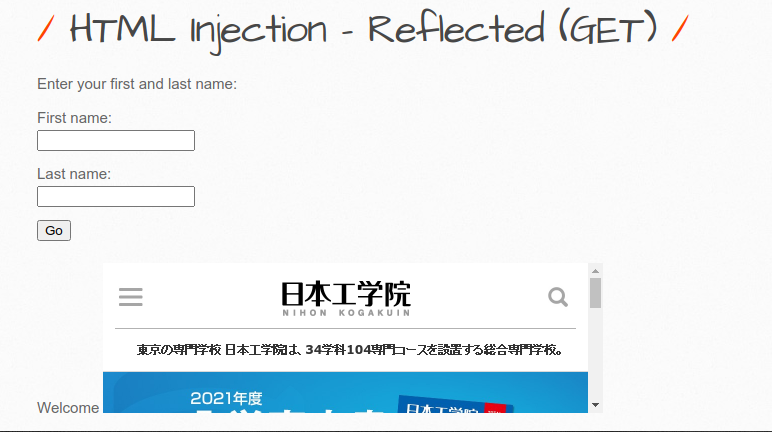
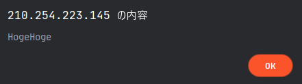
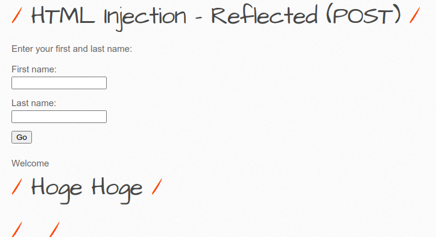
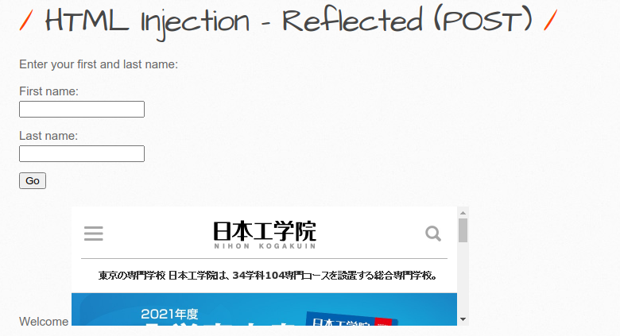
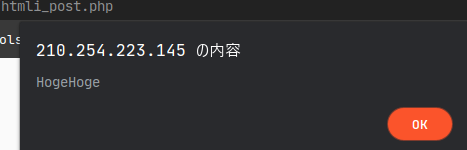
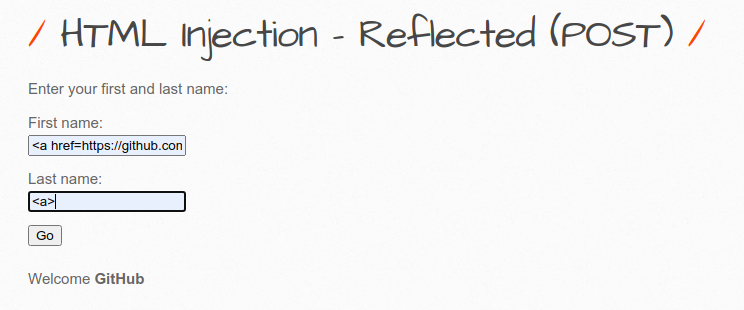

# 2020/08/19 - 第10回

## 課題

### 指示のあったキャプチャ

### 例以外のコードを入力したキャプチャ

### HTMLのGETとPOSTの違い

GETはブラウザのURLに内容を付加して情報を渡すため、履歴に残る可能性がある(セキュリティ的にまずい)

### HTMLインジェクションとは

Webアプリケーションの脆弱性の1つ。ユーザから送られたデータをHTMLとして表示する仕組みを応用して、悪意のある書き込みやスクリプトが実行されてしまうもの

### HTMLインジェクションの回避

- サニタイジングする
> エスケープ処理すること
- 入力値の制限
> 数字のみ等

### Set the security level: medium

入力した値がHTMLタグとしてではなく、サニタイジングされていることで文字列として読み込まれていることがわかる